CUDA Path Tracer
================

**University of Pennsylvania, CIS 5650: GPU Programming and Architecture,
Project 3 - CUDA Path Tracer**

* Neel Shejwalkar
  * [LinkedIn](https://www.linkedin.com/in/neel-shejwalkar/), [twitter](https://x.com/neelshej)
* Tested on: Ubuntu 24.04, AMD Ryzen 9 9950X 16-Core @ 4.3GHz 64GB, RTX 5080 (GB203, sm_120) 16GB, CUDA 13.0, driver 595.84 (friend's workstation, over SSH)

## General

This is a path tracing engine that supports many interesting rendering and performance-focused features. For each, a description of the feature and performance analysis with graphs will be provided. 

## Core Features

### Stochastic antialiasing

| Antialiasing off | Antialiasing on |
|:---:|:---:|
| 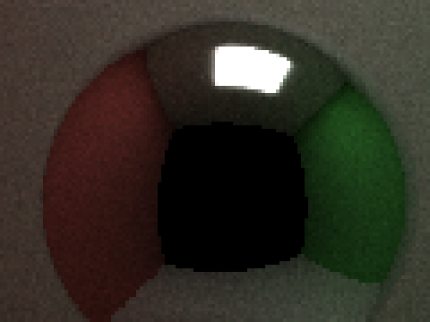 | 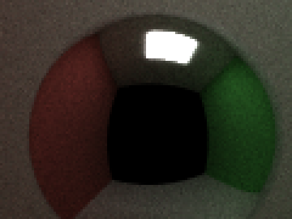 |

*4x zoom (nearest neighbor) on the mirror sphere, 800x800, 5000 iteration*

This engine supports stochastic antialiasing by jittering the direction of primary rays from the camera center through each pixel slightly. This small randomness in direction changes every iteration, so the throughputs received and the colors written by that ray for the final image get blended together. The result is smoother edges: observe the harsh jagged staircase for the edges of the Cornell box in the reflection of the mirror ball on the left, and the visually smoother, straighter lines for the antialiased render on the right. 

### Sorting paths by material

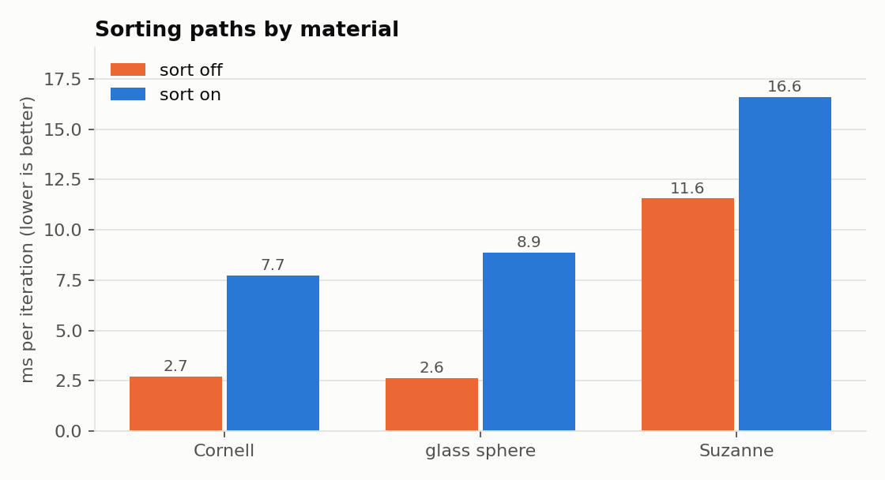

We also support a (potential) optimization by sorting all of the paths by the id of the material that that path hits using thrust::sort_by_key's radix sort before coloring the pixel. This has the theoretical benefit of reducing warp divergence (specifically, in the shadeMaterial kernel) by ensuring nearby threads are far less likely to diverge on the various branches taken by different material handling. In reality, the sorting worsened the performance greatly. This is because the sorting is expensive compared to the shading itself - the shading branches are small. With a scene with many different materials and complex shading or microfacet models, we would expect this to pay off more.

## Extra Features
### Refraction

| Mirror | Glass (IOR 1.5) |
|:---:|:---:|
|  | 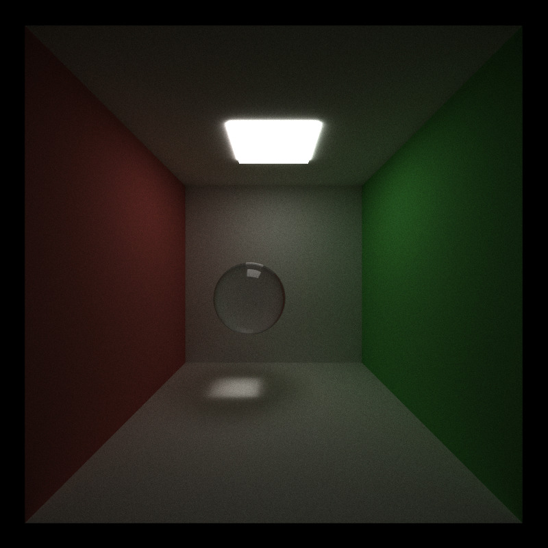 |

| Water (IOR 1.33) | Glass (IOR 1.5) | Diamond (IOR 2.42) |
|:---:|:---:|:---:|
| 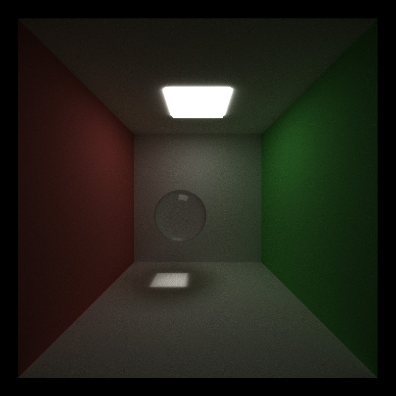 |  | 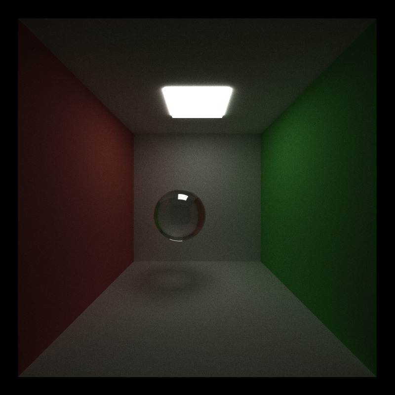 |

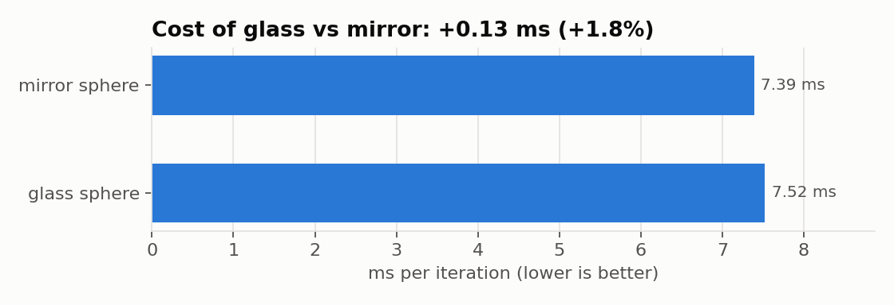

Along with diffuse and reflective materials, this engine supports shading for refractive surfaces, calculating the angle of the refracted ray using Schlick's approximation for the Fresnel equations. The performance impact of adding this feature is minimal: on my machine, an iteration of a refractive glass sphere cost only 2% more than a mirror sphere (7.52 ms/iter vs 7.39 ms/iter). 

The implementation here involves, for every ray intersecting the refractive material, reflecting that ray with a calculated probability R (from Schlick's equations) and refract it with probability 1-R, meaning that in expectation over iterations, the rendering is correct. The benefits of this implementation are apparent: the full Fresnel equations involve expensive square root operations, and choosing one branch forgoes any splitting or reweighting math. The extra work here is a few math instructions, so against a serial CPU, there wouldn't be much difference per-thread. The GPU version diverges on different rays randomly selecting whether to reflect or refract.

Further work here includes adapting the triangle intersection test (currently glm::intersectRayTriangle) to be two-sided, which would allow arbitrary meshes to be refractive.

### Depth of Field

| Pinhole (APERTURE 0) | Focused on the near sphere | Focused on the far sphere |
|:---:|:---:|:---:|
| 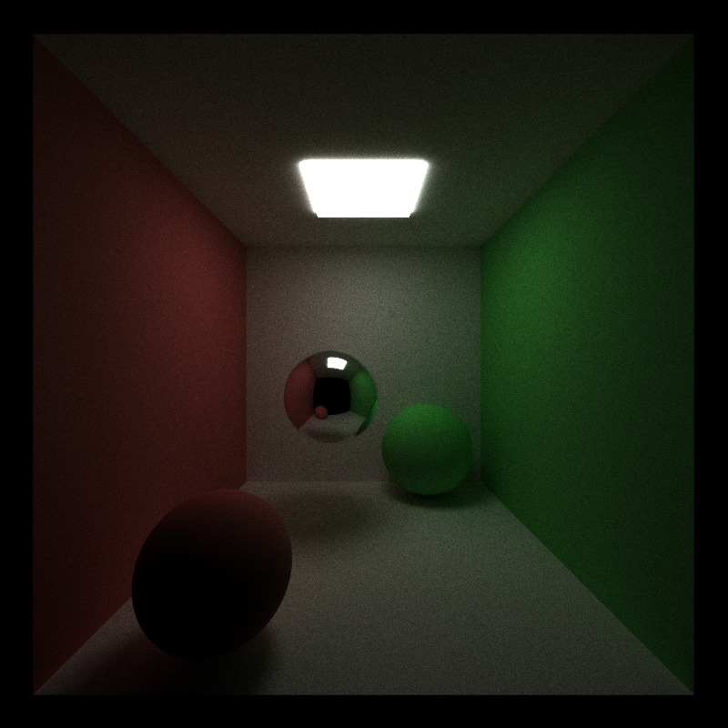 | 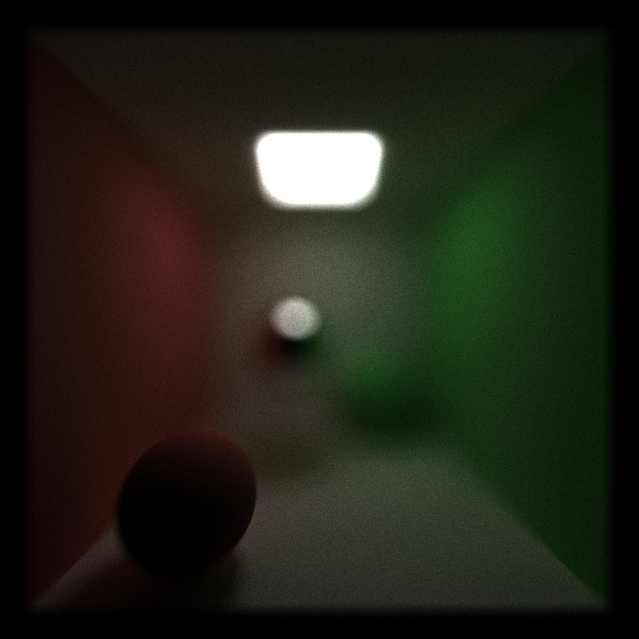 | 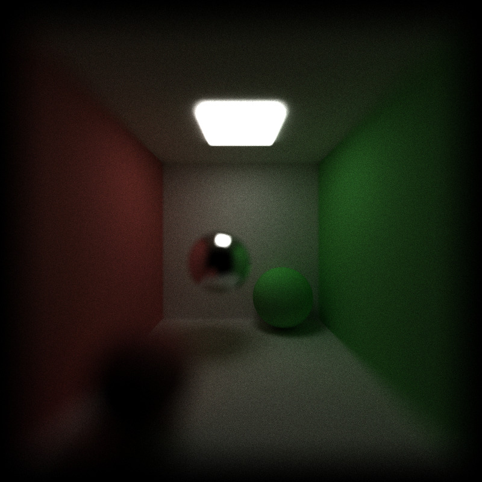 |

*APERTURE 1.0, FOCAL_DIST 6.5 (near) vs 13.9 (far), 2000 spp, `scenes/cornell_dof_spheres.json`*

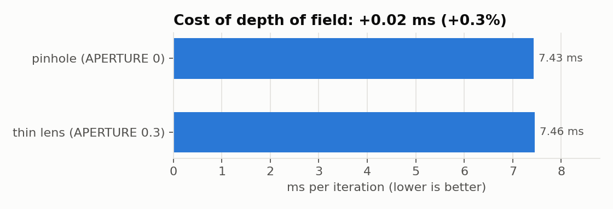

The engine also supports depth of field, implemented by jittering the origin of every primary ray and aiming it at the projected point on the focus plane, simulating the thin lens equation. The performance impact here is negligible, adding only 0.03 ms/iteration. This is an extremely lightweight feature: it only runs once per ray at the beginning of the iteration, and reuses the random number generator from the stochastic anti-aliasing. Additionally, the radius of the lens is a global property of the whole scene, so there is no divergence between threads. Against a theoretical CPU implementation, once again, the cost per ray would be identical: there's nothing inherent to depth of field that favors one or the other.

Further work here would involve more correct/uniform sampling methods, or support for non-circular apertures. 

### OBJ meshes with bounding box culling

| Suzanne (968 triangles) | Spot (5,856 triangles) |
|:---:|:---:|
| 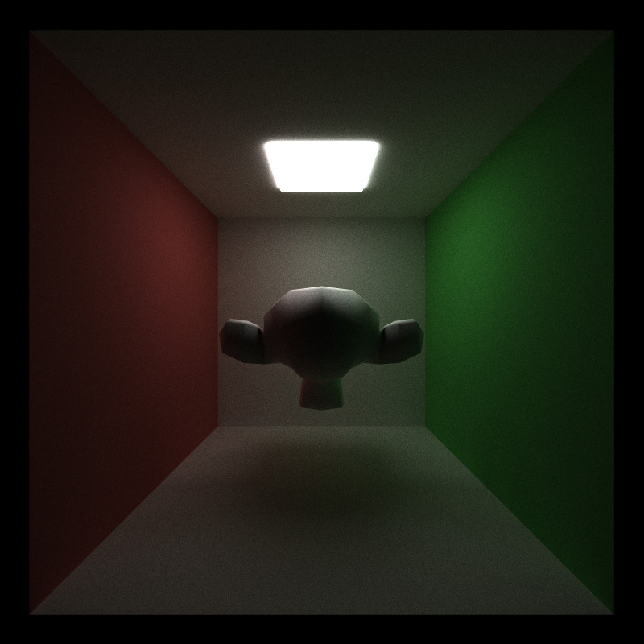 | 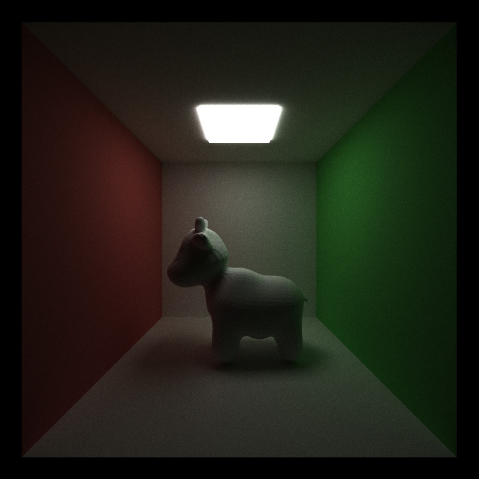 |

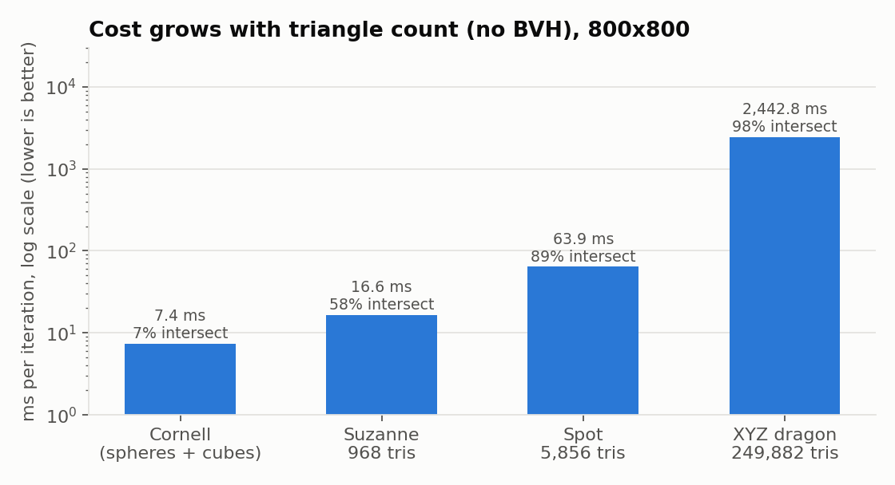

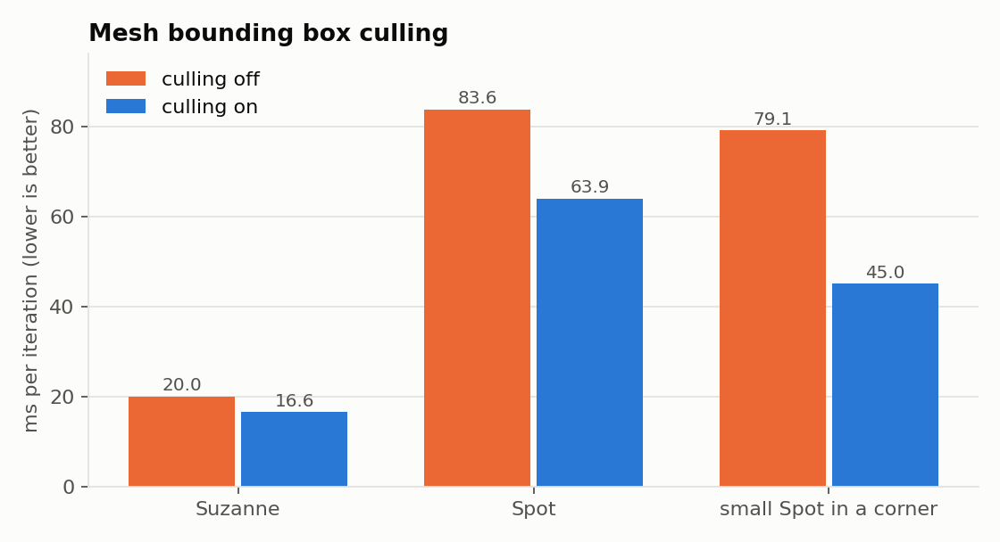

This engine supports loading and rendering arbitrary meshes using tinyOBJ, automatically parsing and storing the mesh and its constituent triangles into a scaled Geom object, and calculating intersections using triangle intersection tests. All meshes share a single triangle array, resulting in only a single H2D copy rather than one per mesh.

Bounding box culling is also supported: this is a big performance gain, especially for scenes with smaller bounding boxes. Here, rays that miss the bounding box entirely skip the intersection calculations for the whole mesh (potentially many triangles), leading to around ~40% lower times per iteration for small, dense models like Spot. Given that this engine does not have any acceleration structures in place, the time to calculate these intersections grows linearly with the triangle count. Stream compaction (explained below) in particular benefits meshes by pruning dead paths.

The GPU benefits greatly over the equivalent CPU implementation here, primary from broadcasting and caching - every thread in a warp loops through the triangles in the same order, meaning the fetch is shared across the warp.

Further optimizations for intersection testing here include implementing an acceleration structure like a Bounding Volume Hierarchy to more efficiently find the intersection point, which would exponentially speed this up. Implemented using RT Cores via an API like OpTiX would further boost performance here. Additionally, loading triangles cooperatively into shared memory might also provide benefits.

### Shared memory compaction

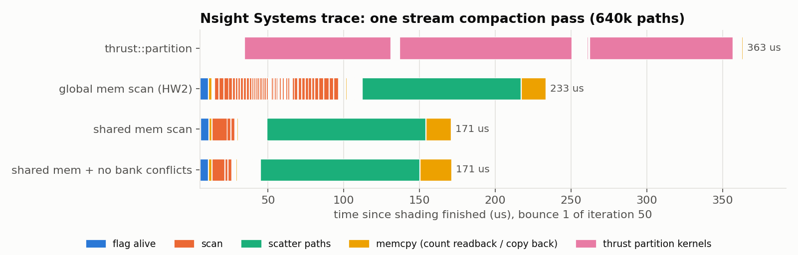
One compaction pass takes Thrust 363 µs, global memory 233 µs, and shared memory 171 µs. We can also see the copying back is identical.

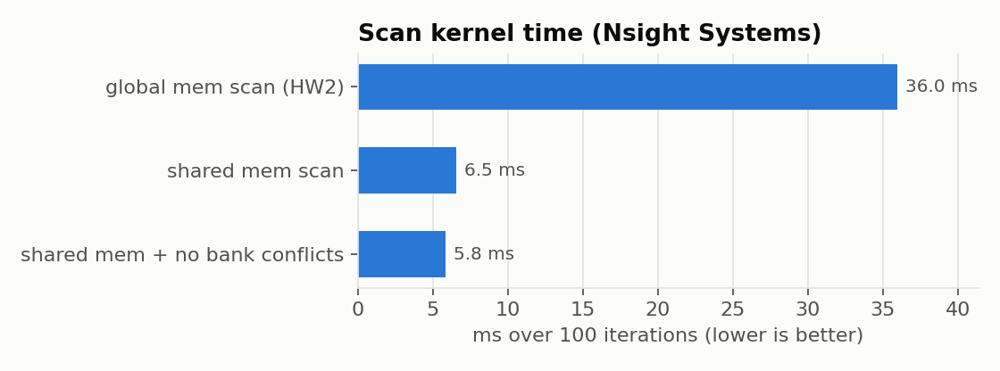
In isolation, we benefit almost 6x from shared memory and 11% on top of that from avoiding bank conflicts.

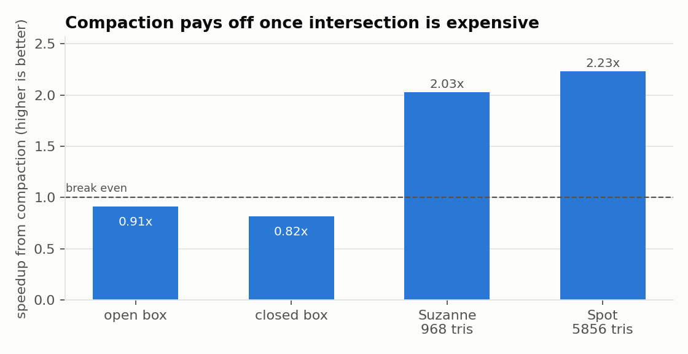

This engine implements work-efficient scanning and compacting, used to partition dead paths and stop computation for them during an iteration. The scan kernels utilize shared memory and avoid bank conflicts using padding. 

For every compaction, using our implementation with shared memory improves the operation by around 2.4x compared to thrust. The benefits of compacting depend heavily on the properties of the scene: if each path is expensive to process (large meshes, in our case) or many paths die early, compaction benefits performance greatly. Looking at the numbers for high poly meshes like Spot and Suzanne versus a few simple objects in the default Cornell box makes this apparent.

Our implementation benefits from a single launch per scan block, rather than 2*logn launches (the orange stripes in the first graph), one per scan level. Unlike the textbook scan approach, this implementation doesn't pad the entire array up to a power of two, but only the last chunk. It also supports coalesced loads.

Against a CPU implementation, the scan is far more optimized for parallelism algorithmically. Given that the path data lives on the GPU, however, sending it back over PCIe every iteration would be infeasible.

Further optimizations here include better data management (scattering only the path indices rather than the entirety of the PathSegment structs), deeper work on the kernel (warp-level scanning with __ballot_sync), or a better algorithm (single pass scanning). 

### Russian roulette

| | Roulette off | Roulette on |
|---|:---:|:---:|
| open box | 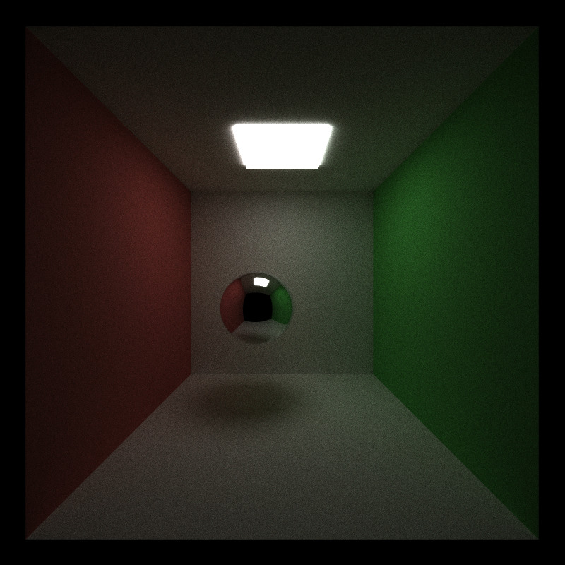 | 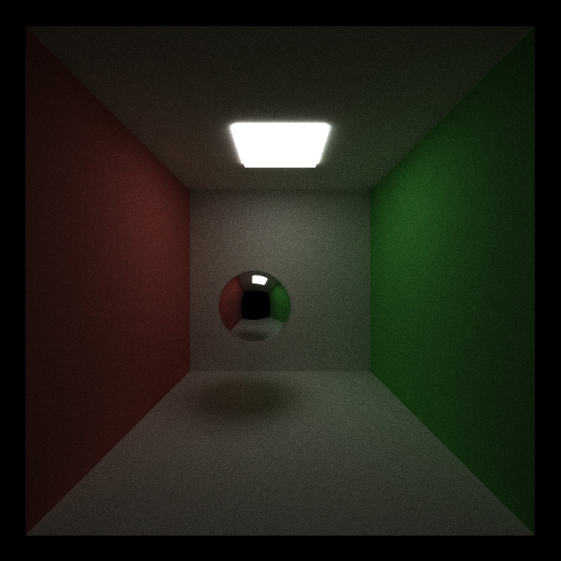 |
| closed box | 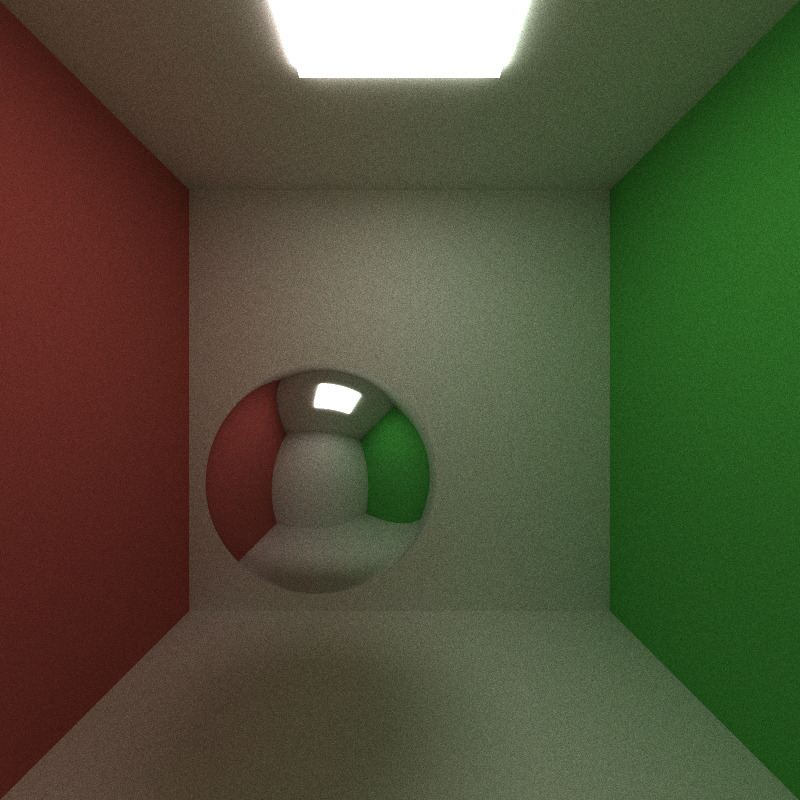 |  |

*2000 spp each*

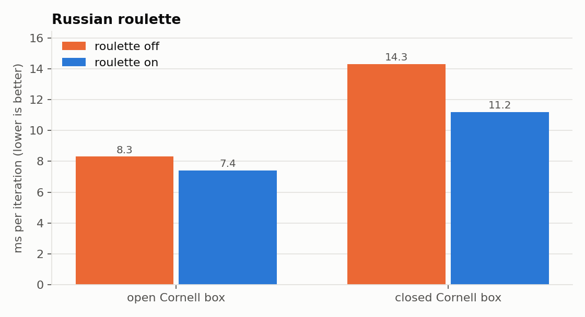

This engine supports Russian Roulette path pruning after 3 bounces. Each ray after this point survives with a probability proportional to its brightest channel, ensuring that dimmer paths die early. 

This results in major benefits, including 11% faster iterations in the open box scene and 22% faster for the closed box. The latter benefits more, because rays bounce farther and there are more candidates for pruning. Similar to the depth of field, there is practically no overhead, costing only one extra random number per bounce. This technique works hand in hand with the efficient compaction (explained above) - path are chosen to be eliminated by Russian Roulette, and are ensured to be dead by compaction.

There is no real difference against a CPU implementation. GPU threads handling dead threads are pruned via compaction, and so there is no loss in terms of idle threads or warps.

Further optimizations here include tuning the minimum depth parameters, or adjusting the probability of elimination based on other factors, like luminance or overall throughput.

## Further Analysis

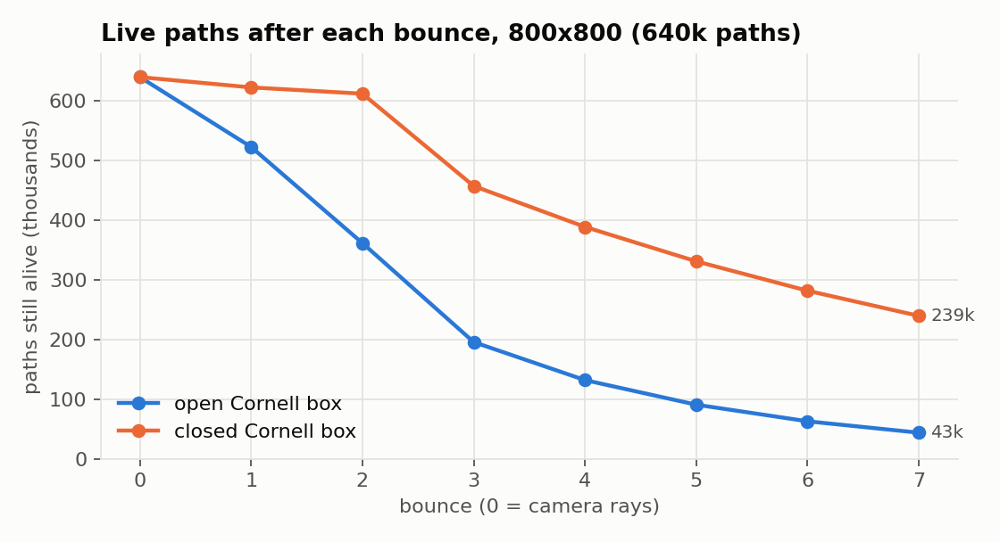

| Live paths | start | bounce 1 | bounce 2 | bounce 3 | bounce 4 | bounce 5 | bounce 6 | bounce 7 | bounce 8 |
|---|---:|---:|---:|---:|---:|---:|---:|---:|---:|
| open box | 640,000 | 522,886 | 361,713 | 195,792 | 132,058 | 90,821 | 63,012 | 43,899 | 0 |
| closed box | 640,000 | 622,739 | 612,196 | 457,407 | 388,877 | 331,149 | 281,871 | 239,741 | 0 |

It's clear to see the stark difference between the open and closed box. The open box drops paths quickly as the majority of them miss or bounce out of the scene entirely out of the open front. The sharp drop at 3 iterations comes from the fact that Russian Roulette (explained above) kicks in at this point.

*800x800, shared memory compaction, Russian roulette on, bounce limit 8*

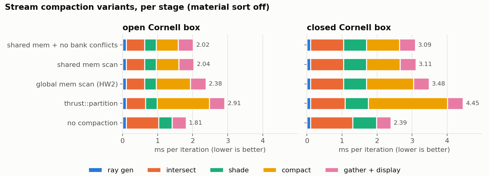

In terms of compaction, in an open box it makes intersection faster, but costs too much time itself to be a net positive. For a closed box, its even worse, as compaction costs more (more paths to compact). However, as explained in its dedicated section, compaction helps significantly on scenes with meshes.

## Extra Images

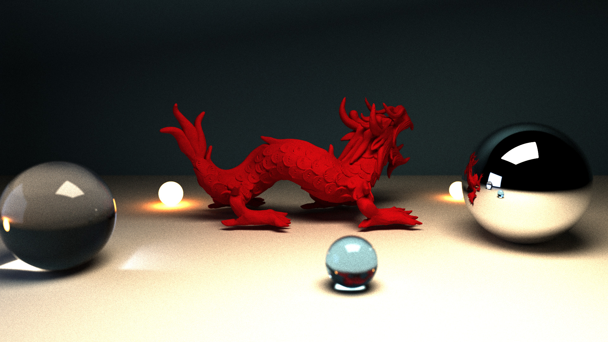

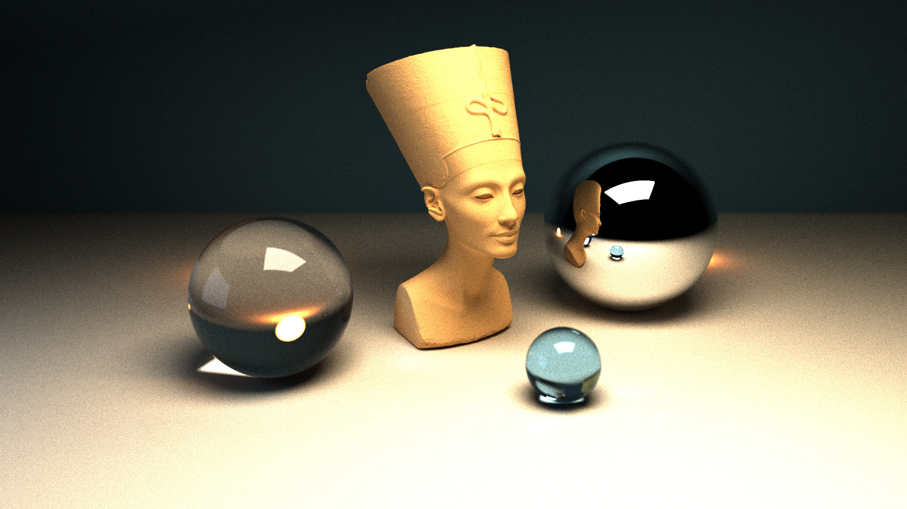

## Bloopers

| | |
|:---:|:---:|
| 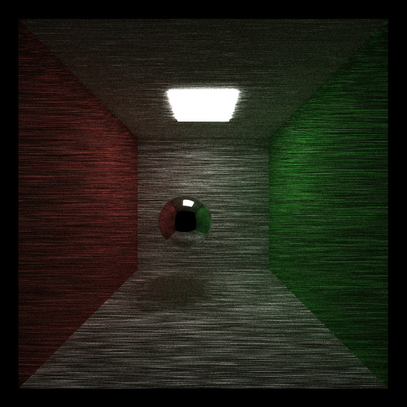 | 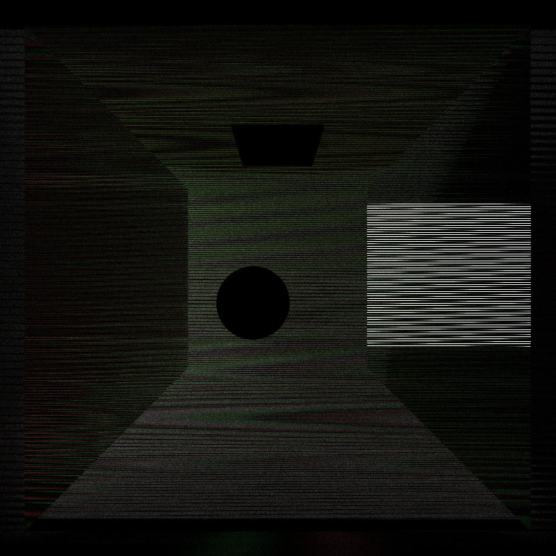 |
| random seed missing the iteration | paths sorted without their intersections |
| 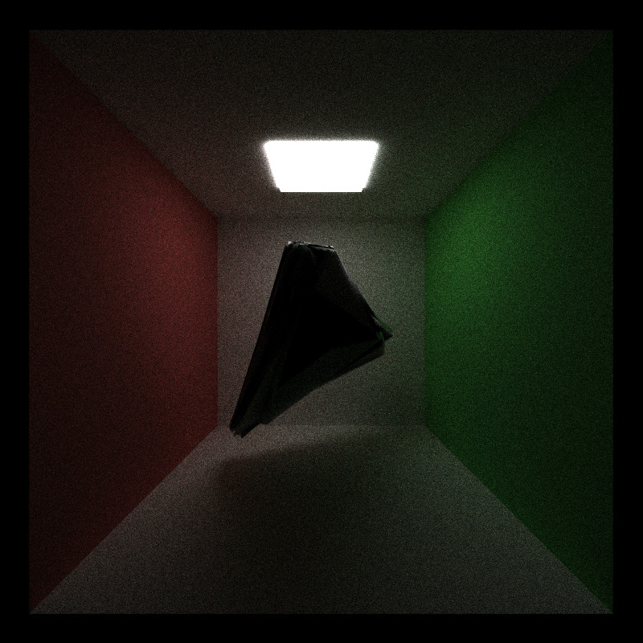 | |
| OBJ vertex index without the right stride | |

## References

**Physically Based Rendering (PBRT)**
* [4ed 2.1: Monte Carlo Basics](https://pbr-book.org/4ed/Monte_Carlo_Integration/Monte_Carlo_Basics)
* [4ed 9.2: Diffuse Reflection](https://pbr-book.org/4ed/Reflection_Models/Diffuse_Reflection)
* [4ed A.5: Sampling Multidimensional Functions](https://pbr-book.org/4ed/Sampling_Algorithms/Sampling_Multidimensional_Functions) (cosine-weighted hemisphere, sampling a unit disk)
* [4ed 9.3: Specular Reflection and Transmission](https://pbr-book.org/4ed/Reflection_Models/Specular_Reflection_and_Transmission) (Snell's law, Fresnel equations)
* [4ed 9.5: Dielectric BSDF](https://pbr-book.org/4ed/Reflection_Models/Dielectric_BSDF) (choosing reflection vs. transmission by Fresnel)
* [4ed 5.2.3: The Thin Lens Model and Depth of Field](https://pbr-book.org/4ed/Cameras_and_Film/Projective_Camera_Models#TheThinLensModelandDepthofField)
* [4ed 6.5: Triangle Meshes](https://pbr-book.org/4ed/Shapes/Triangle_Meshes) (ray-triangle intersection)
* [4ed 6.1: Basic Shape Interface](https://pbr-book.org/4ed/Shapes/Basic_Shape_Interface) (ray-bounds slab test)
* [4ed 3.10: Applying Transformations](https://pbr-book.org/4ed/Geometry_and_Transformations/Applying_Transformations) (transforming normals with the inverse transpose)
* [3ed 13.7: Russian Roulette and Splitting](https://pbr-book.org/3ed-2018/Monte_Carlo_Integration/Russian_Roulette_and_Splitting)
* [4ed 13.4: A Better Path Tracer](https://pbr-book.org/4ed/Light_Transport_I_Surface_Reflection/A_Better_Path_Tracer) (Russian roulette in a path tracer)
* [4ed 15: Wavefront Rendering on GPUs](https://pbr-book.org/4ed/Wavefront_Rendering_on_GPUs) (per-stage kernels, path queues)

**Papers, articles, and blogs**
* [GPU Gems 3, Ch. 39: Parallel Prefix Sum (Scan) with CUDA](https://developer.nvidia.com/gpugems/gpugems3/part-vi-gpu-computing/chapter-39-parallel-prefix-sum-scan-cuda) (Harris, Sengupta, Owens)
* [Megakernels Considered Harmful: Wavefront Path Tracing on GPUs](https://research.nvidia.com/publication/2013-07_megakernels-considered-harmful-wavefront-path-tracing-gpus) (Laine, Karras, Aila 2013)
* [Fast, Minimum Storage Ray/Triangle Intersection](https://fileadmin.cs.lth.se/cs/Personal/Tomas_Akenine-Moller/pubs/raytri_tam.pdf) (Möller, Trumbore 1997)
* [Reflections and Refractions in Ray Tracing](https://graphics.stanford.edu/courses/cs148-10-summer/docs/2006--degreve--reflection_refraction.pdf) (de Greve 2006)
* [Schlick's approximation](https://en.wikipedia.org/wiki/Schlick%27s_approximation)
* [CUDA C++ Best Practices Guide](https://docs.nvidia.com/cuda/cuda-c-best-practices-guide/index.html)

## Credits

**Code**
* [tinyobjloader](https://github.com/tinyobjloader/tinyobjloader) by Syoyo Fujita and contributors (MIT), used to load `.obj` meshes

**Models** (`scenes/models/`, downloaded from [alecjacobson/common-3d-test-models](https://github.com/alecjacobson/common-3d-test-models))
* Suzanne: [Blender](https://www.blender.org/)
* Spot: [Keenan Crane](https://www.cs.cmu.edu/~kmcrane/Projects/ModelRepository/#spot), from *Robust Fairing via Conformal Curvature Flow* (Crane, Pinkall, Schröder 2013)
* XYZ RGB Dragon: [Stanford 3D Scanning Repository](http://graphics.stanford.edu/data/3Dscanrep/), courtesy of the Stanford Computer Graphics Laboratory (scanned with an XYZ RGB auto-synchronized camera)
* Bust of Nefertiti: Egyptian Museum and Papyrus Collection, Berlin, scan released through [Cosmo Wenman's FOIA request](https://www.thingiverse.com/thing:3974391), [CC BY-NC-SA 4.0](https://creativecommons.org/licenses/by-nc-sa/4.0/). Renders of it here are shared under the same license.

### Specs
| | |
|---|---|
| SMs | 84 |
| CUDA cores | 128/SM = 10,752 total |
| Max threads / SM | 1536 (48 warps) |
| Max blocks / SM | 24 |
| L2 cache | 64 MB |
| Shared memory | 100 KB/SM, 48 KB/block |
| Registers | 65,536 per SM |
| Memory bus | 256-bit GDDR7 @ 15001 MHz = 960 GB/s |
| VRAM | 16 GB |
| SM clock (max) | 3090 MHz |
| Peak FP32 | 66,447 GFLOP/s |